# homestay_booking_application

## Tools used
1. VS Code for writing code
2. Postman for api checking

## Dependencies
npm i bcryptjs colors dotenv express express-async-handler jsonwebtoken mongoose nodemon

## Code run command
1. npm run server

## Queries
1. Create => User.create({})
2. find => User.findById, findOne
3. $nin => Notin
4. $or => check this or that
5. $gte => Greater than or equal to
6. $lte => less than or equal to

## Routes
1. Create user => POST/api/users/register_user
2. Login user => POST/api/login/login_user
3. logout => POST/api/logout/logout_user
4. Create homestays => POST/api/homestay/create_homestays
5. Get homestays => GET/api/homestay/homestays_avail
6. Create booking => POST/api/booking/booking-home

## Outputs

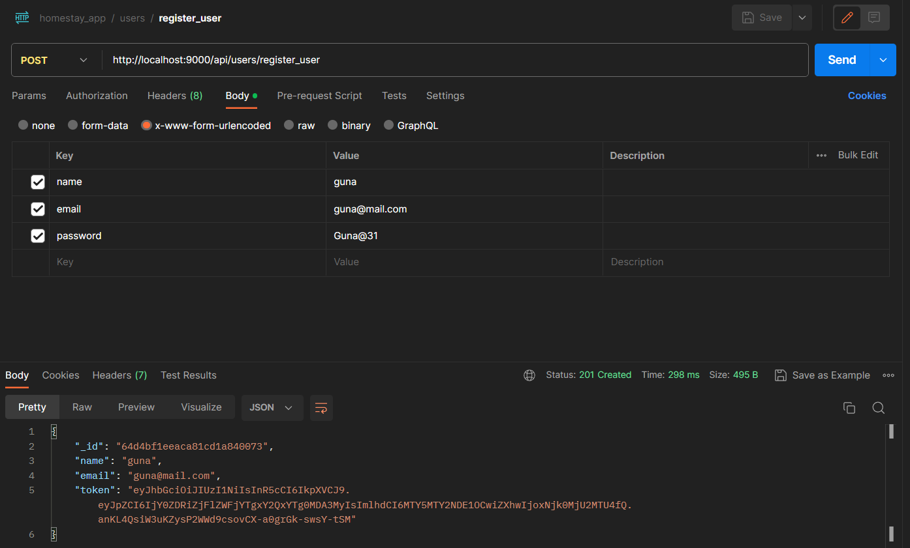
**1.Register user**

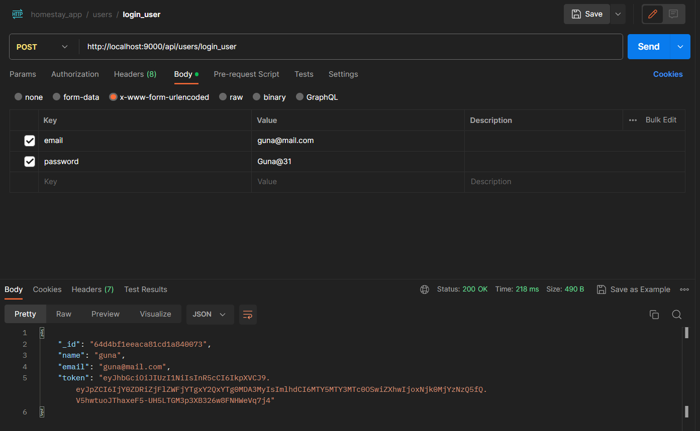
**2.Login user**

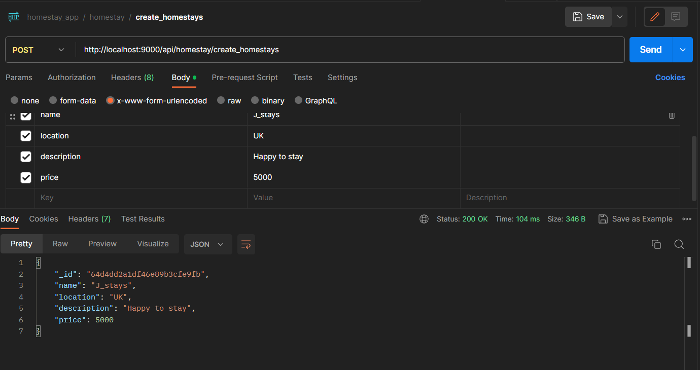
**3.Create Homes**

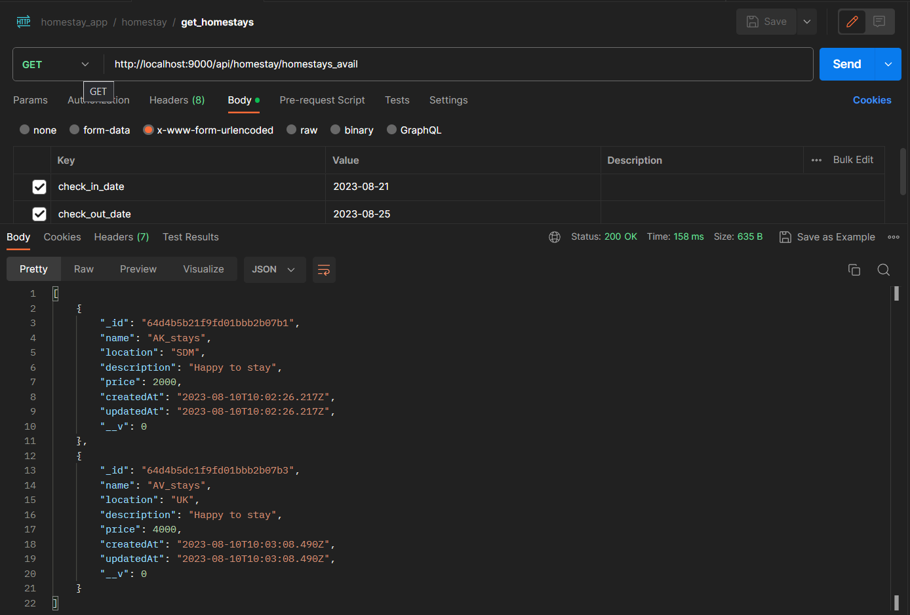
**4.Get Homes**

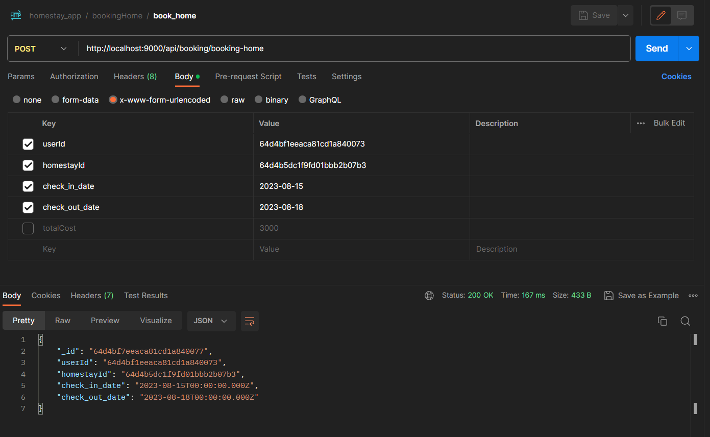
**5.Booking homes**

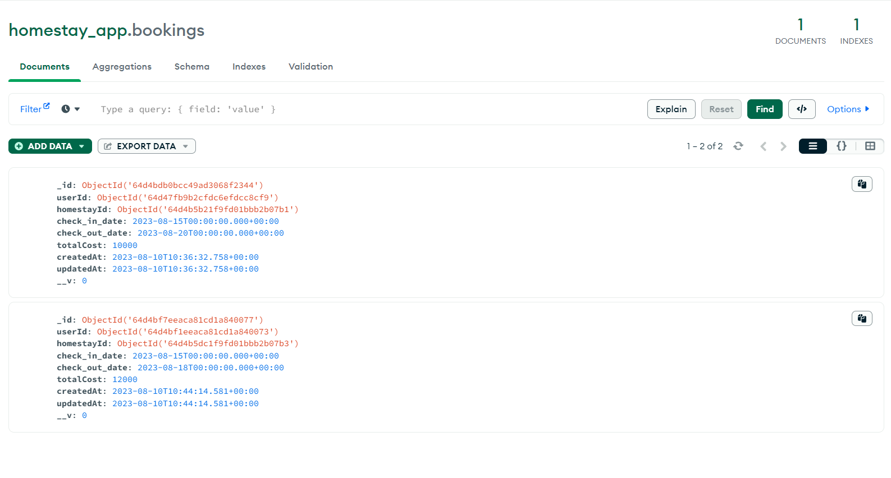
**6.Db for storing users booking details**

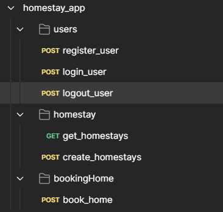

**Postman folder Image**

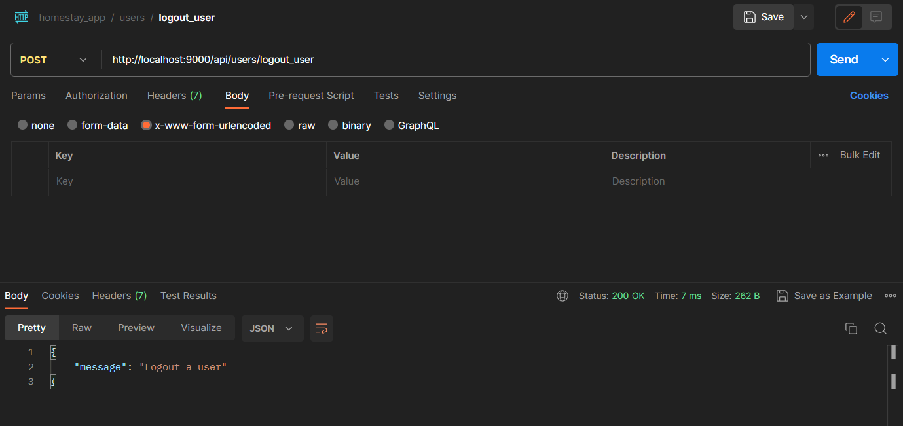
**Logut user**

## DB Images

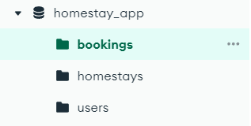

**DB Folder structure**

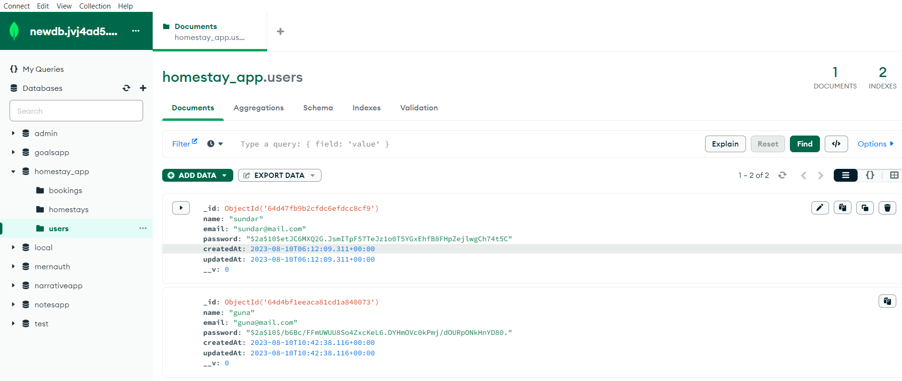
**Users DB image**

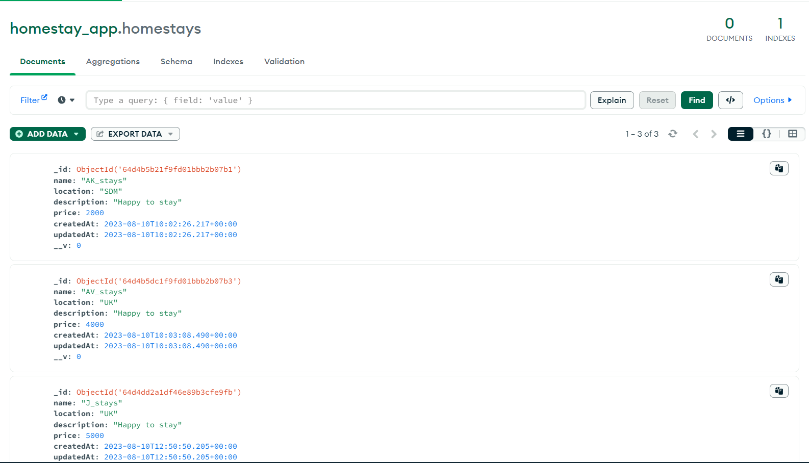
**Homestays DB image**

